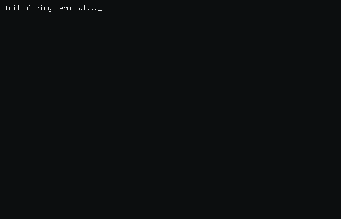

  

---

<picture>
  <source media="(prefers-color-scheme: dark)" srcset="https://readme-typing-svg.demolab.com?font=Fira+Code&weight=600&size=22&pause=1000&color=00D9FF&background=00000000&center=true&vCenter=true&random=false&width=600&lines=Mojo+%7C+Zig+%7C+Rust+%7C+Assembly" />
  
</picture>

---

## Experience

**Blockchain Ticketing & Lottery System**
Blockchain-based ticketing and lottery platform running on Binance Smart Chain and Polygon. Implemented automated draw logic via smart contracts and a secure token distribution mechanism with on-chain provenance guarantees.

**Multi-Model Prediction System**
Prediction pipeline combining XGBoost with ensemble ML models, trained on 3+ years of historical data. Integrated multiple external APIs to enrich feature sets and improve forecast accuracy across time-series segments.

**Exam Analytics Platform**
Comprehensive assessment analytics platform built on a multi-tenant architecture supporting branches, teachers, and students as independent scopes. Implemented advanced pedagogical analysis including Bloom taxonomy mapping, DoK-level tagging, subject dependency graphs, and adaptive difficulty scoring across a 14-model relational schema.

**UE5 Cross-Layer Impact Analyzer**
Developer tooling for Unreal Engine 5 that computes the full blast radius of a C++ or Blueprint change before it is applied. Extends codegraph's C++ dependency engine with a Blueprint inheritance and soft/hard asset reference layer, backed by a unified SQLite graph and an MCP server for AI agent integration.

**UE5 Shader Analysis Tool**
Analysis tool for Unreal Engine 5 that inspects shader compilation outputs and rendering behavior at the material and pass level. Designed to assist in identifying redundant instructions, overdraw patterns, and cross-pass dependency issues.

**CapsuleSim**
Low-resource multi-agent simulation system built in Rust around isolated capsule processes. Each capsule hosts a Dynamic GNN-based agent graph with continual learning via EvolveGCN-style temporal updates. Uses AirLLM-inspired layer-wise disk sharding to run 500+ node graphs within 3-4 GB RAM on CPU-only hardware. Capsule types cover academic trend forecasting, personal learning routing, and emergent hypothesis generation.

**City District Digital Twin**
Simulation of a city district driven by live data streams covering population density, traffic flow, and environmental sensors. Autonomous agents operate within the model and a fire spread prediction module runs probabilistic simulations against the live state.

**QuantaVault**
Quantum-resistant personal security vault appliance built on .NET 10 Native AOT targeting the Variscite DART-MX93 (NXP i.MX93, Cortex-A55). Implements CNSA 2.0 Level 5 cryptography — ML-KEM-1024, ML-DSA-87, SLH-DSA-SHA2-256s — with a four-layer encryption stack, EdgeLock Secure Enclave PUF key derivation, BBRAM tamper zeroization, and a Courier microSD air-gap data transfer pipeline. Zero USB, zero network, AHAB secure boot.

**Modular Educational Games Platform**
Cross-platform desktop learning suite in C++20 and Qt6. Plugin-based architecture allowing independent game modules to be loaded at runtime via a shared IGameModule interface. Includes multi-tenant student profiling, progress tracking, adaptive difficulty, and an optional ML evaluation layer for identifying per-student knowledge gaps.

---

---

---

---

  

